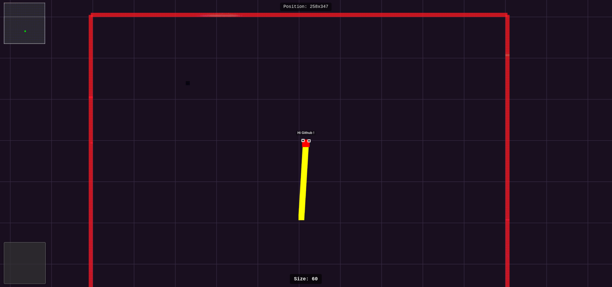
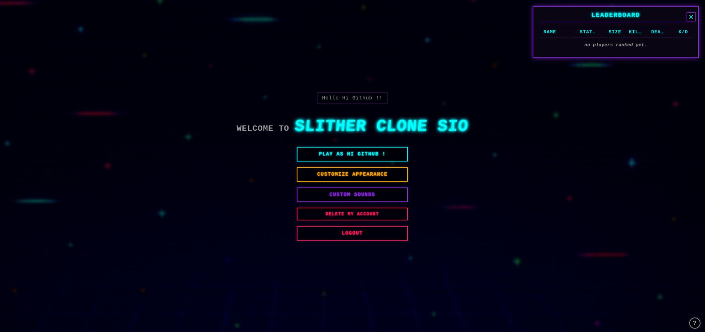
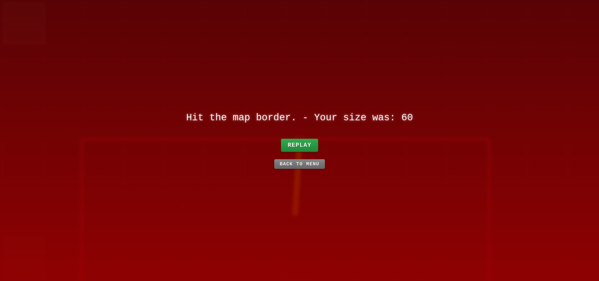

<!-- // --- README.md --- -->

# 🐍 Slither Clone SIO ✨ - A Full-Stack & Supercharged Slither.io Clone!

<p align="center">
  
  
  
</p>

Welcome to **Slither Clone SIO**, a modern and feature-rich reinterpretation of the classic Slither.io game. Developed entirely in JavaScript with Node.js, Express, Socket.IO, and **WebGL** for ultra-performant client-side rendering, this project goes beyond a simple clone. It integrates a robust architecture, advanced customization features, a comprehensive admin system, internationalization support, and optimizations for a smooth and engaging gaming experience. 🚀

## 🌟 Key Features (Features Packed!)

This project isn't just a snake eating dots. Discover everything it has under the hood:

**🎮 Gameplay & User Experience:**

- **Real-time Multiplayer:** Compete against other players live thanks to Socket.IO.
- **High-Performance WebGL Rendering:** Smooth and reactive graphics handled by the client's GPU (`game-renderer.js`, `webgl-utils.js`).
- **Classic Movement:** Control your snake with the mouse.
- **Boost:** Accelerate to surprise your opponents (with size consumption and visual particles ✨).
- **Animated Food:** Food pellets that "breathe" and are attracted to players.
  - **Smart Spawn:** Players spawn in safer locations, evaluating multiple candidates to avoid immediate proximity to borders or large opponents (with fallback to random spawn). ✅
- **Precise Collision:** Optimized collision detection via `worker_threads` and point-segment algorithm.
- **Ghost Mode (Admin):** Mobile spectator with zoom, player selection, and moderation actions. 👻
- **WebGL Minimap:** Visualize the battlefield and nearby players.
- **Dynamic Leaderboard:** Real-time ranking (Top 10 displayed), sorted by status then size, with K/D ratio.
- **Notifications:** Player connect/disconnect messages (with anti-spam).
- **Admin Messages:** Broadcast messages to all players with a stylish "glitch" effect. 👾
- **Custom Game Over Screen:** End-game screen indicating the reason and final size.
- **2D Text Overlay:** Player names and indicators (frozen ❄️) rendered on a separate canvas.
- **Browser Zoom Prevention:** For an uninterrupted gaming experience.
- **Accessibility:** Keyboard navigation in menus.
- **Robust Offline Mode:** `offline.html` page with Snake minigame (ZQSD/WASD/Arrow controls) and automatic reconnection attempts (managed by Service Worker). PWA Ready! 📶
- **🌍 Internationalization (i18n):** User interface fully translated using `i18next`. Language is automatically detected from the browser, with fallbacks.
  - **Supported Languages (+30):**
    - 🇬🇧/🇺🇸 English (en)
    - 🇫🇷 French (fr)
    - 🇪🇸 Spanish (es)
    - 🇩🇪 German (de)
    - 🇨🇳 Chinese - Simplified (zh)
    - (Note: Full Right-to-Left layout for languages like Arabic, Persian, Urdu is planned but not yet implemented - see [Issue #10](https://github.com/mathe00/slither-clone-sio/issues/10))
    - 🇸🇦 Arabic (ar)
    - 🇧🇷/🇵🇹 Portuguese (pt)
    - 🇷🇺 Russian (ru)
    - 🇯🇵 Japanese (ja)
    - 🇮🇳 Hindi (hi)
    - 🇰🇷 Korean (ko)
    - 🇮🇹 Italian (it)
    - 🇹🇷 Turkish (tr)
    - 🇮🇩 Indonesian (id)
    - 🇵🇱 Polish (pl)
    - 🇮🇳 Bengali (bn)
    - 🇵🇰/🇮🇳 Urdu (ur)
    - 🇻🇳 Vietnamese (vi)
    - 🇹🇭 Thai (th)
    - 🇵🇭 Filipino (fil)
    - 🇮🇷/🇦🇫/🇹🇯 Persian (Farsi) (fa)
    - 🇲🇾/🇧🇳/🇸🇬 Malay (ms)
    - 🇳🇱/🇧🇪 Dutch (nl)
    - 🇺🇦 Ukrainian (uk)
    - 🇬🇷 Greek (el)
    - 🇸🇪 Swedish (sv) _(representing Scandinavian)_
    - 🇫🇮 Finnish (fi)
    - 🇭🇺 Hungarian (hu)
    - 🇷🇴 Romanian (ro)
    - 🇨🇿 Czech (cs)
    - 🌍 Swahili (sw)
    - 🌍 Hausa (ha)
    - 🇳🇬 Yoruba (yo)
    - 🇳🇬 Igbo (ig)
    - 🇹🇼/🇭🇰 Chinese - Traditional (zht)

**🎨 Advanced Customization:**

- **Snake Colors:** Choose the head and body color.
- **Complex Skins:**
  - **Single Color:** Classic and effective.
  - **Repeating Patterns:** Define up to 8 colors for a unique body pattern. 🎨
- **Trail Effects:** Add style to your wake with various particle effects (Sparkle, Smoke, Fire, Ice, Electric, Rainbow, Bubbles, Glitch, Void, Confetti)! ✨💨🔥🧊⚡🌈🫧👾🌌🎉
- **Custom Sounds:** Upload your own MP3 files for key events (death, kill, boost) via `localStorage`. 🔊

**🔒 Security & Administration:**

- **User Accounts:** Secure account creation (`bcrypt` hashing), persistent sessions (`httpOnly` cookies).
- **Full Admin System:**
  - Dedicated web interface (`admin.html`, localized via i18next) with tabs.
  - User management (CRUD, admin status, suspension).
  - Pruning of inactive accounts (with preview). 🧹
  - Server/game configuration editable live (some require restart).
  - View current configuration.
- **Admin Authentication:** Secure access via admin session.
- **Rate Limiting:** Limits account creation per IP.
- **Anti-Cheat:** Suspicious teleportation detection, self-collision check (configurable).
- **Security Modes (Collision):** Choice between `high` (server-side checks via workers, secure) and `low` (client-side checks, less secure). See technical details.
- **In-Game Moderation (Admin Ghost):** Kick, Ban (suspend + disconnect), Freeze/Unfreeze, Kill, Clear (removes without leaving food). 🚫

**🔧 Architecture & Tech Stack:**

- **Modular Node.js Backend:** Organized code (`apiRoutes.js`, `gameLogic.js`, `socketHandlers.js`, `serverLifecycle.js`). **Sends i18next keys** to the client for localized messages.
- **Modular JavaScript Client:** Separated logic (`game-main.js`, `game-renderer.js`, `webgl-utils.js`, `ui-logic.js`, `sound-manager.js`, `trail-effects.js`, `admin-logic.js`). **`ui-logic.js` and `admin-logic.js` handle i18next initialization and UI text rendering.**
- **Clean Express API:** Dedicated routes for authentication, customization, administration. **API responses use i18next keys for feedback.**
- **Performance Optimizations:**
  - `worker_threads` for intensive collision calculations.
  - Spatial Grid (`SpatialGrid`) to optimize nearby entity searches.
  - Area of Interest (AoI): Only sends relevant data around the client.
  - Optimized WebGL rendering.
- **Server Lifecycle Management:** Clean startup/shutdown, `server.lock` management.
- **Flexible Configuration:** Server and game settings managed via `config.json`.
- **Data Persistence:** Accounts (`accounts.json`) and sessions (`sessions.json`) saved.
- **Internationalization:** `i18next` library with JSON files in `/public/locales/`.
- **Progressive Web App (PWA):** Service Worker (`service-worker.js`) caches core assets, **including locale files and i18next libraries**, for offline functionality (localized offline page).

## ⚙️ Technical Deep Dive

Some key mechanisms explained:

- **Snake Rendering (WebGL):**
  Each snake is represented by an array of segments (`trail`). The current WebGL renderer (`game-renderer.js`) draws each segment as a colored quad. The size of the segments (`segmentRadius`) and head (`headRadius`) is calculated dynamically based on the player's `maxTrailLength` (logarithmically for a pleasant visual effect). Eyes are also drawn procedurally as overlapping quads. Rendering uses matrices (Model-View-Projection) managed by `webgl-utils.js` to position, orient, and scale each part.

- **Trail Effects (Particles):**
  The `trail-effects.js` module defines "spawner" functions for each effect type. When a snake moves (and depending on the effect chosen in `skinData`), `game-main.js` periodically calls the appropriate spawn function. This function generates data for one or more particles (initial position, velocity, lifespan, color, size, type). These particles are stored in the `particles` array of the player object. The rendering loop (`game-renderer.js`) updates the position and opacity of each particle and draws them (often as simple quads with additive blending for glow effects).

- **Real-time Communication (Socket.IO & Alternatives):**
  Socket.IO is currently used for bidirectional communication. It handles sending client inputs, broadcasting the game state (via AoI), notifications, etc.
  - **Client -> Server:** `mouse_move`, `boost`, `joinGame`, `clientCollisionDetected` (`low` mode), admin actions...
  - **Server -> Client(s):** `state`, `leaderboard`, `gameOver` (with i18next keys), `mapSizeUpdate`, `adminMessage`, various notifications (with i18next keys)...
  - **Scalability:** For a very large number of concurrent players, Socket.IO (based on TCP) could become a bottleneck. Alternatives like **WebRTC** (for P2P or via SFU) or **WebTransport** (based on HTTP/3 and QUIC, allowing unreliable and ordered/unordered UDP streams) could offer superior performance but would significantly complicate the network architecture.

- **Collision Detection & Security Modes (`high`, `medium`, `low`):**
  The server can operate in three distinct security modes, configurable via `config.json` or the admin panel (`/admin`), primarily affecting collision handling and anti-cheat:
  - **`high` Mode:** This mode offers the highest level of security and fairness.
    - **Head-Body Collision:** Detection is performed **server-side** authoritatively for **all players** (including admins playing normally). Dedicated workers (`collisionWorker.js`) calculate the distance between a player's head and the **line segments** forming the trail of nearby opponents (point-segment detection, more precise). The server solely determines if a collision occurred.
    - **Anti-Cheat (Teleportation):** The server uses a **standard** tolerance (`TELEPORT_TOLERANCE_FACTOR`) to detect suspicious movements for all players.
    - **Usage:** Recommended for situations requiring maximum cheat prevention, though it may impose a higher server load with many players.
  - **`medium` Mode (Recommended for Production):** This mode provides a balance between security and performance by trusting admin players for their own collision detection.
    - **Head-Body Collision (Non-Admins):** Detection for non-admin players is performed **server-side** authoritatively via workers, similar to `high` mode.
    - **Head-Body Collision (Admins):** Admin players (when not in ghost mode) perform their own collision detection **client-side**. If an admin's client detects a collision for the admin, it sends a `clientCollisionDetected` message to the server, which then trusts this message. This reduces server load for admin players.
    - **Anti-Cheat (Teleportation):** The server uses a **standard** tolerance (`TELEPORT_TOLERANCE_FACTOR`) for non-admin players and an **increased** tolerance (`TELEPORT_TOLERANCE_FACTOR * 1.2`) for admin players, making it slightly more lenient for admins regarding potential lag-induced "teleports".
    - **Usage:** This is the **recommended mode for most production environments** as it maintains server-side authority for regular players while offloading some computation for trusted admin users, offering a good compromise. 👍
  - **`low` Mode (Client + Lightweight / Insecure):** This mode delegates most collision logic to the client to significantly reduce server load, at the cost of security.
    - **Head-Body Collision:** Detection is performed **client-side** for **all players** (`game-main.js`). The player's browser checks if its own head touches the points of other players' trails (point-point detection, less precise). If a collision is detected, the client sends a `clientCollisionDetected` message to the server. **The server trusts this message** and triggers the player's death without performing its own collision check via workers.
    - **Anti-Cheat (Teleportation):** The server uses an **increased** tolerance (`TELEPORT_TOLERANCE_FACTOR * 1.2`) for all players to detect suspicious movements, reducing the risk of kicking legitimate players due to lag but making cheat detection less effective.
    - **Usage:** Primarily intended for **debugging**, testing, or private games among trusted players. **This mode is inherently insecure and highly vulnerable to cheating**, as a modified client can simply choose not to send the collision message. ⚠️
  - **Optimization (Workers & Spatial Grid):** In `high` and `medium` modes (for non-admins), the server uses a `SpatialGrid` to optimize nearby entity searches. This data is then sent to `worker_threads` for precise head-body collision calculations, avoiding blocking the main Node.js thread.

- **Skin System:**
  Skin information is stored in the `skinData` object within `accounts.json` for registered players.
  ```json
  "skinData": {
    "bodyType": "pattern", // "single" or "pattern"
    "bodyColor": "#44ff00", // Base color or for 'single' type
    "patternColors": ["#b739f4", "#9fc93f", ...], // Array of colors for 'pattern'
    "trailEffect": "glitch" // Name of the trail effect
  }
  ```
  This data is sent to the client during `joinGame` (for logged-in players) or directly by the client (for temporary players). The server includes it in `state` messages. The client (`game-renderer.js`) uses `skinData` to choose how to draw the body (single color or alternating `patternColors`), and `game-main.js` uses it to trigger the correct particle effect via `trail-effects.js`. The head color (`headColor`) is stored separately in `accounts.json` but managed alongside `skinData` in forms and the `/updateSkin` API.

## 🗺️ Roadmap & Future Ideas

This project is a solid foundation, but here are some potential improvements and planned fixes:

### ✅ To-Do (Priority)

- **Optimization & Scalability:**
  - [ ] **Socket Performance:** Evaluate and potentially enhance the Socket.IO server's capacity to handle a large number of concurrent players. ([Issue #2](https://github.com/mathe00/slither-clone-sio/issues/2))
    - _Ideas:_ Node.js profiling, message optimization (frequency, size, binary format?), clustering Node.js, consider WebTransport/WebRTC for >1000 player scenarios?
  - [ ] **AoI (Area of Interest) Precision:** Currently, AoI only considers the _head_ position of other players. A player whose tail is the only part within the AoI won't be visible, potentially causing unfair deaths. ([Issue #3](https://github.com/mathe00/slither-clone-sio/issues/3))
    - _Approach 1:_ Send the full data of a player as soon as _any_ part of their body (trail) enters the client's AoI. Simple but potentially higher bandwidth usage.
    - _Approach 2:_ Send only the _part_ of the trail that is visible within the AoI. More complex to manage server and client-side (truncating/reconstructing trails) but more bandwidth-efficient.
- **UI (User Interface):**
  - [ ] **Simplify Main Menu:** Reorganize/group buttons for a less cluttered and more intuitive interface. ([Issue #4](https://github.com/mathe00/slither-clone-sio/issues/4))
- **Gameplay:**
  - [ ] **Improve Collision Detection Accuracy & Bot Collisions:** Address inaccuracies with player tail collisions and significantly bugged bot collisions. ([Issue #1](https://github.com/mathe00/slither-clone-sio/issues/1))
  - [ ] **Boost Particle Consistency:** Particles generated during boost should have the same appearance/type as standard food or be a distinct but visually consistent type.
- **Internationalization (i18n):**
  - [ ] **Expand Language Support:** Add translations for over 15 new languages to reach a broader global audience. ([Issue #9](https://github.com/mathe00/slither-clone-sio/issues/9))
  - [ ] **Implement Full Right-to-Left (RTL) Layout Support:** Adapt HTML and CSS for languages like Arabic, Persian, Urdu. ([Issue #10](https://github.com/mathe00/slither-clone-sio/issues/10))
- **Visual Enhancements:**
  - [ ] **Improved Godmode Shield Effect:** Enhance the visual feedback for the temporary godmode/shield active at spawn with a dynamic pulsing effect. ([Issue #11](https://github.com/mathe00/slither-clone-sio/issues/11))
- **Server-Side Robustness & Security:**
  - [ ] **Implement Robust Server-Side Input Validation and Sanitization:** Rigorously validate all data received from clients via Socket.IO and HTTP APIs. ([Issue #12](https://github.com/mathe00/slither-clone-sio/issues/12))
  - [ ] **Enhance Error Handling in Server Game Loop:** Implement more comprehensive `try...catch` blocks in `gameLogic.js` to prevent crashes from isolated entity errors. ([Issue #13](https://github.com/mathe00/slither-clone-sio/issues/13))
  - [ ] **Implement Atomic File Saving Strategy:** Ensure `accounts.json`, `sessions.json`, and `config.json` are saved atomically to prevent data corruption. ([Issue #14](https://github.com/mathe00/slither-clone-sio/issues/14))
  - [ ] **Implement Structured Server Logging with Levels:** Transition from `console.log` to a structured logging library (e.g., Winston, Pino) for better debugging and monitoring. ([Issue #15](https://github.com/mathe00/slither-clone-sio/issues/15))

### ⏳ Future Improvements (Lower Priority)

- [ ] **Rendering Engine Migration:**
  - [ ] Explore migrating the client-side rendering from the current custom WebGL implementation to a dedicated game framework like **Phaser**. ([Issue #5](https://github.com/mathe00/slither-clone-sio/issues/5))
  - _Rationale:_ Phaser could simplify development (scene management, sprites, physics helpers), potentially offer comparable or better performance depending on usage, and benefit from a larger community and ecosystem. This would involve a significant refactor of `game-renderer.js`, `webgl-utils.js`, and parts of `game-main.js`.
- [ ] **Advanced Gameplay:**
  - [ ] Add optional power-ups (temporary invincibility, food magnet, etc.) configurable via the admin panel. ([Issue #6](https://github.com/mathe00/slither-clone-sio/issues/6))
  - [ ] Create a Battle Royale mode with a progressively shrinking zone. ([Issue #7](https://github.com/mathe00/slither-clone-sio/issues/7))
- [ ] **Code Refactoring & Cleanup:**
  - [ ] Full code review to improve comments (in English), remove obsolete development comments. ([Issue #8](https://github.com/mathe00/slither-clone-sio/issues/8))
  - [ ] Ensure consistent JSDoc documentation for important functions.
  - [ ] Standardize code style further if necessary.

## 🤔 Creator's Note & Contributions

This project is a personal adventure into web game development, largely achieved with the help of AI (Google's Gemini 2.5 Pro and its impressive ability to handle large code contexts!). I'm not a professional developer, just an enthusiast tinkering and learning by doing. 😅

The code isn't perfect by the strictest professional standards, but it works and integrates an impressive number of features, including full internationalization. The main goal was to explore possibilities and have fun.

**Contributions are welcome!** If you're an experienced developer (or even a motivated beginner!) and see areas for improvement, bugs to fix, or want to implement one of the roadmap ideas (like the Phaser migration!), feel free to open an _Issue_ or a _Pull Request_ on the GitHub repository. Your help would be greatly appreciated! 🙏

## 💖 Support the Project

If you've found this project useful or fun, consider making a small donation. I've spent a lot of time developing this game, and your support helps keep projects like this going.

I currently accept donations through:

**Bitcoin**  
`zpub6nL6JpeLNPiK44KpPbBxQc8emSar7ZsbvLf1vbQsYmUAaHNj289i9q2XtE4H5cYLiFCxWSpWP88HBf7F75n34998LDutyHkdzKBJYxyMDoQ`

**Ethereum**  
`0xe0b8007dca71940ab09a2e025f111216f0eb1c4e`

If you have any questions about donations or encounter any issues, please feel free to open a GitHub issue.

## 🚀 Quick Start

1.  **Prerequisites:** Ensure you have [Node.js](https://nodejs.org/) (version 18.x or higher recommended) and npm installed.
2.  **Clone the Repository:**
    ```bash
    git clone https://github.com/mathe00/slither-clone-sio.git
    cd slither-clone-sio
    ```
3.  **Install Dependencies:**
    ```bash
    npm install
    ```
4.  **Configuration (Optional but Recommended):**
    - The `backend/config.json` file will be created with default values on the first run if it doesn't exist.
    - **Admin Account Setup:** To set or reset the password for the default administrator account (username: "admin"), stop the server and run:
      ```bash
      node backend/server.js --set-new-password YOUR_ADMIN_PASSWORD
      ```
    - This command will create an "admin" account if it doesn't exist, or update its password. This account will have administrative privileges.
    - Adjust other game settings in `backend/config.json` as needed (map size, FPS, etc.).
5.  **Start the Server:**
    ```bash
    node backend/server.js
    ```
6.  **Play!** Open your browser and navigate to `http://localhost:3000` (or the configured port). Your browser's language should be automatically detected for the UI text.

## 📜 License

This project is distributed under the **MIT License**. See the `LICENSE` file or [choosealicense.com/licenses/mit/](https://choosealicense.com/licenses/mit/) for more details.

## 🤔 Creator's Note & Contributions

This project is a personal adventure into web game development, largely achieved with the help of AI (Google's Gemini 2.5 Pro and its impressive ability to handle large code contexts!). I'm not a professional developer, just an enthusiast tinkering and learning by doing. 😅

**Why "Slither Clone SIO"?**  
Well, because! 😉 Let's just say the reason is a well-kept secret.

**Future Maintenance?**  
Honestly, I'm not sure. I don't have specific plans to maintain it actively. If I get a bit bored and inspiration strikes, maybe! But for now, consider it a snapshot of a fun experiment.

**The "Why" Behind This Project:**  
It all started because I was bored and wanted to play Slither with friends. Trying to meet up for 1v1s on public servers for these kinds of games is a hassle. So, I thought, "Why not self-host?" I looked around for existing clones, but what I found was often old, a bit clunky, lacked features, and most importantly, didn't have multiplayer.

So, I decided to build this one, heavily leveraging AI because, as you might guess from my other GitHub repos, I'm not a traditional developer. I use AI extensively to bring these projects to life, and hey, it works! That's what counts, right? 😉 I know this approach sometimes raises eyebrows among "purist" developers who aren't fans of non-devs like me building things this way, but the journey and the result are what matter to me.

**Current State & Thoughts on Public Release:**  
Right now, I don't think the project is ready for a large-scale public deployment. It's fantastic for having fun with friends in a self-hosted environment. I've poured dozens of hours into it, and if you feel like contributing to make it better, or even supporting me a little financially to help offset some of the AI API/token costs I've incurred, that would be amazing (see the Support section below!).

For a truly public-ready version, it would need a more polished codebase – perhaps migrating to TypeScript for better maintainability. More critically, I believe the reliance on Socket.IO, while great for smaller groups, wouldn't be performant enough to handle a massive number of concurrent players. Even though I've tried to optimize and introduce security modes that shift some load/trust to the client, a different networking approach would likely be necessary for large-scale play.

**Contributions are welcome!** If you're an experienced developer (or even a motivated beginner!) and see areas for improvement, bugs to fix, or want to implement one of the roadmap ideas (like the Phaser migration or a networking overhaul!), feel free to open an _Issue_ or a _Pull Request_ on the GitHub repository. Your help would be greatly appreciated! 🙏

---

Have fun growing your snake! 🐍🎉
